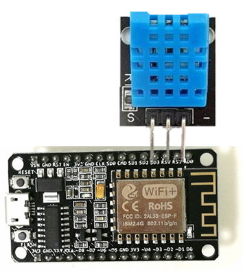
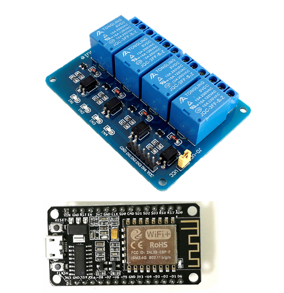
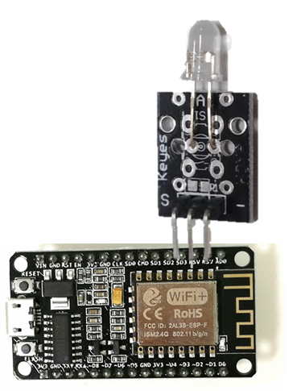
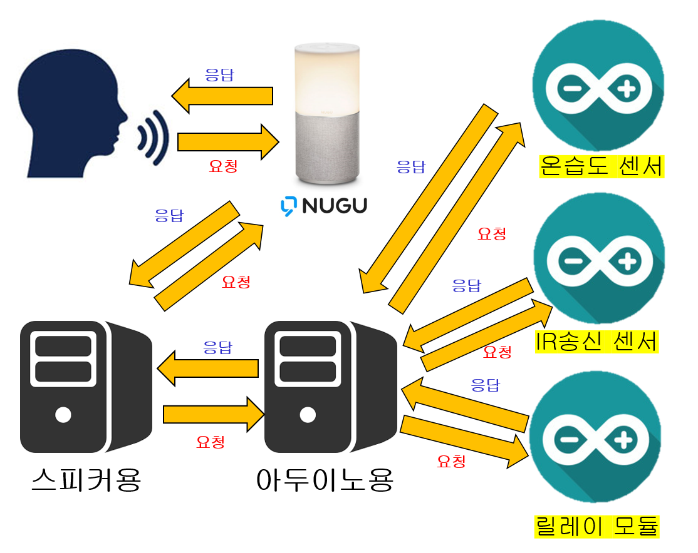
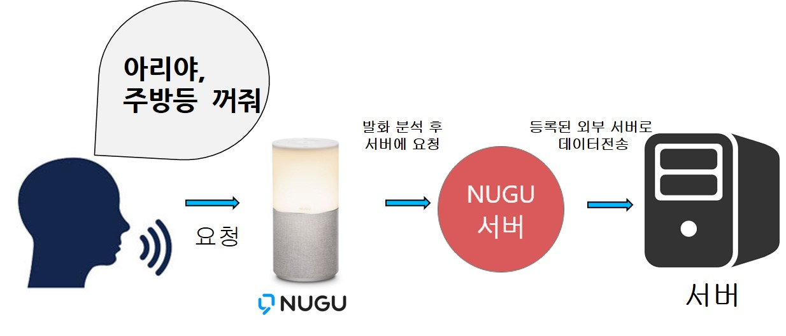
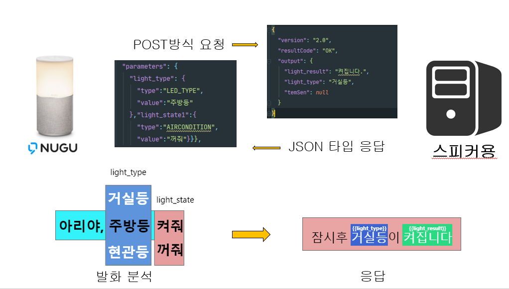

# 인공지능 스피커를 활용한 홈IOT 시스템 구축


본 프로젝트는 인공지능 스피커 NUGU와 아두이노를 사용하여 스마트 홈을 구축 하는 프로젝트 입니다.

본 프로젝트에서는 총 3개에 와이파이 모듈이 사용되었으며 온습도센서, 릴레이 모듈, IR 송신 센서 총 3가지 센서를 사용하였습니다.

### 🛠 기술 스택
> - SpringBoot
>   - Java  
> - Docker
>   - docker-compose


### 실행
```
git clone https://github.com/wnstlr0615/SmartHomeServer.git
cd SmartHomeServer

> build 작업
./gradlew build
 
> 서버 실행
docker-compose up
```


### 온습도 센서
방의 온도 및 습도 감지 기능이 있는 센서로 기본적으로 온도와 습도를 알려줄 때 사용되 며 특정 온습도 조건에 따라 요청을 보낼쌔 사용 된다.  
ex) 온도가 27도 이상 일 경우 에어컨 가동, 습도가 낮으면 가습기 가동



### 릴레이 모듈
3V를 사용하는 아두이노를 사용하여 더 높은 전압을 가지는 물체의 연결을 끊어주거나 이어주는 기능을 수행 한다.
해당 프로젝트에서는 220V를 사용 하는 방의 전등을 인공지능 스피커를 이용하여 꺼주거나 켜주는 기능을 수행 한다.



### IR 송신 센서 
IR 송신 센서는 우리 주변에서 사용하는 리모컨의 기능을 수행한다. IR 수신 센서를 통해 미리 리모컨에서 나오는 데이터를 수집한 후
아두이노에 저장했다가 필요한 상황에 송신한다.  
ex) 에어컨, 선풍기, 티비, 등등



## 전체 구성
1. 아두이노 WIFI 모듈(ESP8266)
2. 아두이노 연결 서버(아두이노와 TCP로 연결)
3. 인공지능 스피커와 통신용 서버

## 전체 흐름도



## 사용자 요청에 따른 흐름




## 인공지능 스피커 API 통신



### 참고
[NUGU developers](https://developers.nugu.co.kr/#/)